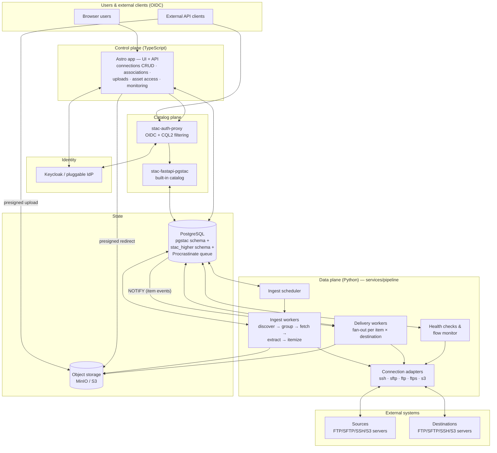
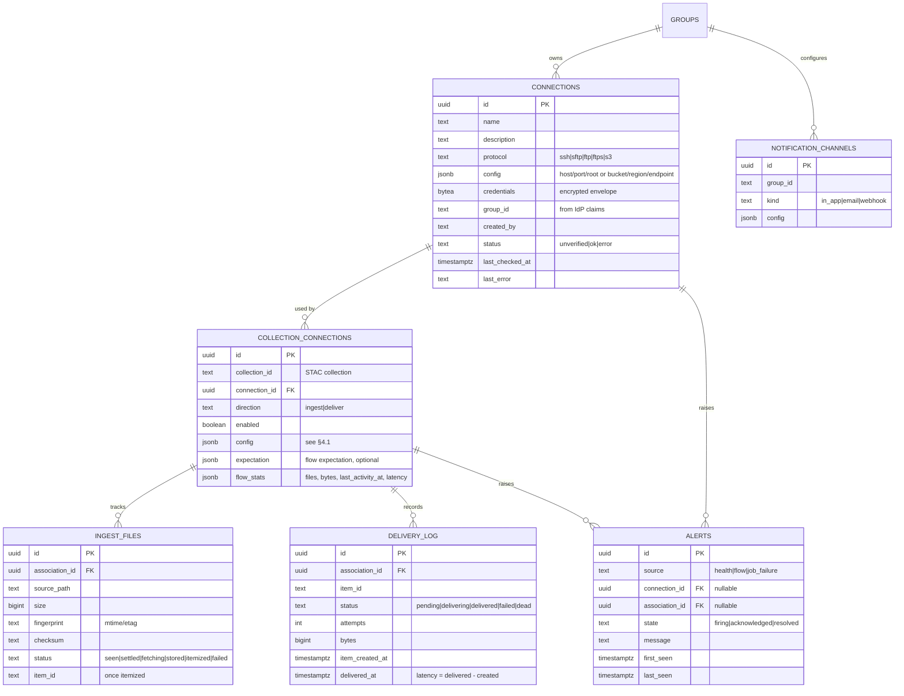
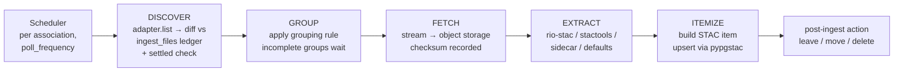
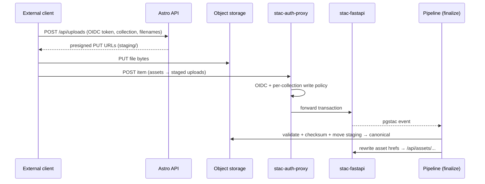
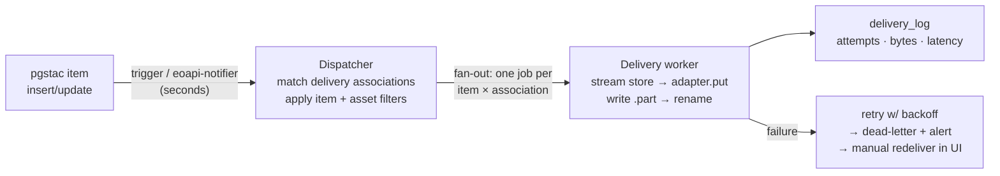

# ROADMAP — Ingest · Catalog · Disseminate Platform

STAC Higher grows from a STAC client into an enterprise platform for **ingesting,
cataloging, and disseminating geospatial products**: files arrive through
connections, become STAC items in a built-in catalog with platform-owned object
storage, and are pushed out through delivery connections in near real time.

This document is the long-term plan: locked decisions, target architecture,
data model, flows, and a phased implementation roadmap. Each phase is designed
to be implemented over 1–3 working sessions and to be independently shippable.

---

## 1. Locked decisions

| Topic | Decision |
|---|---|
| Deployment model | Enterprise, multi-user. Cloud-portable; AWS first. Local dev stays a single `docker compose up`. |
| Identity | OIDC with a pluggable IdP. Keycloak ships in docker-compose as the default; Cognito/Entra/Okta swappable per deployment. Groups and roles come from token claims. |
| Access control | Connections are **group-owned**. Roles: `member` (view group connections, associate them), `operator` (create/edit/operate connections), `admin` (cross-group everything). |
| Ingest semantics | Configurable per collection↔connection association: file patterns, grouping rules, metadata strategy, poll frequency. |
| Delivery semantics | **Assets only**, laid out at the destination by a configurable path template. Event-driven, target latency in **single-digit seconds** plus transfer time. |
| Object storage | All ingested bytes are copied into platform-owned S3-compatible storage (MinIO locally, S3 on AWS). Asset hrefs point at our asset service, never at sources. |
| Pipeline runtime | **Python** (`services/pipeline`): rasterio/rio-stac/stactools/pystac ecosystem for metadata extraction; fsspec/paramiko/ftplib for protocol adapters. |
| Topology | Modular monolith pipeline service. Postgres is system of record **and** job queue (Procrastinate on LISTEN/NOTIFY). Seams kept clean so modules can split into services when load demands. |
| Eventing | pgstac item changes → Postgres trigger/NOTIFY (via eoapi-notifier or a vendored equivalent) → delivery dispatcher. Catches items from *every* write path. |
| eoAPI alignment | Reuse the eoAPI ecosystem wherever it fits (see §3) rather than building parallel infrastructure. |

---

## 2. Target architecture



**Plane separation (the load-bearing idea):**

- **Control plane — Astro app (TS).** All CRUD, permission checks, upload
  brokering, monitoring UI. Never opens SSH/FTP sessions, never holds
  decrypted credentials.
- **Catalog plane — stac-auth-proxy + stac-fastapi-pgstac.** The built-in
  catalog, pre-seeded and undeletable in the client's catalog list.
  stac-auth-proxy enforces catalog read visibility and per-collection write
  rights from OIDC claims (CQL2 filters / OPA policy).
- **Data plane — pipeline service (Python).** The only component that decrypts
  credentials and moves bytes. Four modules behind one process initially:
  ingest scheduler, ingest workers, delivery workers, health/flow monitor.
  All protocol access goes through one adapter interface:
  `list / get / put / test`.
- **Postgres as spine.** One instance, three concerns: pgstac (catalog),
  `stac_higher` (platform entities), Procrastinate (jobs). LISTEN/NOTIFY gives
  seconds-level event dispatch with zero added infrastructure; the queue sits
  behind an interface so SQS/etc. can replace it later without touching
  business logic.
- **Asset access.** Item asset hrefs point at
  `/api/assets/{collection}/{item}/{asset}` → RBAC check → 302 to a
  short-lived presigned object-store URL. Catalog links stay stable even if
  storage moves; storage is never exposed directly.

---

## 3. Reuse from the eoAPI ecosystem

We are already on eoAPI's foundation (pgstac + stac-fastapi-pgstac). Adopt the
rest of the ecosystem instead of rebuilding it:

| Project | Role here | Mode |
|---|---|---|
| [stac-auth-proxy](https://github.com/developmentseed/stac-auth-proxy) | OIDC auth + CQL2 content filtering in front of the built-in catalog; per-collection write policies for direct interaction | Adopt |
| [eoapi-notifier](https://github.com/developmentseed/eoapi-notifier) | pgstac change events → delivery dispatcher trigger | Adopt if mature enough at build time; otherwise vendor its trigger/listener pattern and feed Procrastinate directly |
| [pypgstac](https://github.com/stac-utils/pgstac) | Bulk item upserts from ingest workers | Library |
| [rio-stac](https://github.com/developmentseed/rio-stac) / [stactools](https://github.com/stac-utils/stactools) | Metadata extraction (geometry, datetime, proj/raster extensions) in the EXTRACT stage | Library |
| [titiler-pgstac](https://github.com/stac-utils/titiler-pgstac) | Dynamic raster tiles for map previews of ingested imagery | Adopt in Phase 8 (stretch) |
| [eoapi-cdk](https://github.com/developmentseed/eoapi-cdk) / [eoapi-k8s](https://github.com/developmentseed/eoapi-k8s) | AWS/K8s deployment of the catalog-plane slice; extended with our app, pipeline, and storage | Adopt in Phase 8 |

Not adopted: eoAPI's Lambda ingestor API as-is — our push-ingest (Phase 7)
reuses its *pattern* (authenticated ingest + validation) on our storage and
RBAC instead.

---

## 4. Data model

New tables live in the existing `stac_higher` schema alongside `extensions`.
Migrations continue to run via the existing middleware mechanism (revisit in
Phase 0 if the pipeline service also needs migration authority).



### 4.1 Association `config` shapes

**Ingest** (`direction = 'ingest'`):

```jsonc
{
  "source_path": "/outgoing/products",
  "include": ["**/*.tif", "**/*.xml"],
  "exclude": ["**/*.tmp"],
  "poll_frequency_seconds": 300,
  "grouping": { "rule": "shared_basename", "timeout_seconds": 900, "on_timeout": "ingest_partial" },
  "metadata": { "strategy": "raster_auto", "sidecar": { "pattern": "{basename}.xml", "parser": "generic_xml" }, "defaults": { "datetime": "file_mtime" } },
  "post_ingest": "leave"   // leave | move:<path> | delete
}
```

**Delivery** (`direction = 'deliver'`):

```jsonc
{
  "path_template": "{collection}/{yyyy}/{mm}/{dd}/{item_id}/{filename}",
  "item_filter": null,               // optional CQL2 subset
  "asset_keys": null,                // null = all assets
  "overwrite": "never",              // never | always | if_newer
  "retry": { "max_attempts": 5, "backoff": "exponential" },
  "max_concurrent_transfers": 4      // per-connection concurrency cap
}
```

**Expectation** (optional, either direction):

```jsonc
{ "expect_activity_within_seconds": 3600 }          // ingest: data must flow
{ "deliver_within_seconds": 30 }                    // delivery: NRT SLO
```

### 4.2 Credentials

- Write-only through the API: never returned after creation, UI shows
  metadata only ("SSH key set", "secret key ····").
- Encrypted envelope at rest: AES-256-GCM under a master key from env/secrets
  locally; AWS KMS envelope encryption in cloud deployments. The encryption
  provider is an interface so the two coexist.
- Decryption happens only inside the pipeline service, at job execution time.

### 4.3 Object storage layout

```
{bucket}/
  assets/{collection}/{item_id}/{filename}     # canonical
  staging/{upload_id}/{filename}               # push-ingest uploads, TTL-cleaned
```

---

## 5. Flows

### 5.1 Ingest A — poll-based (connections)



- Every stage is a separate Procrastinate job → per-stage retry, and the
  `ingest_files` ledger makes each stage idempotent (re-runs never
  double-ingest).
- **Settled check:** a file must be unchanged (size/fingerprint) across two
  polls before it is eligible — FTP/SFTP sources are frequently mid-upload.
- Asset hrefs in the created item point at `/api/assets/...`.

### 5.2 Ingest B — push via API (direct interaction)

For collections flagged **externally writable**:



### 5.3 Ingest C — manual (UI)

Item create/edit forms gain asset upload using the same presigned-upload path
as flow B, driven by our frontend.

### 5.4 Delivery (NRT)



- **Isolation:** one job per (item × destination) — a slow FTP server never
  blocks another destination.
- **Burst control:** `max_concurrent_transfers` caps sessions per connection;
  this is the primary NRT tuning knob.
- **Atomic visibility:** write to `{name}.part`, rename on completion —
  consumers never see partial files.
- **Late-added associations** apply to new items only; "backfill existing
  items" is an explicit, user-initiated action.
- **Finalize gating:** for externally-writable collections, the insert event
  arrives while assets are still in staging — the dispatcher defers those
  items until the finalize step (§5.2) marks them ready, so delivery always
  streams from canonical storage and never double-fires on the href rewrite.

### 5.5 Observability

- **Connection health:** scheduled lightweight checks (connect + list) update
  `status` / `last_checked_at` / `last_error`; real job failures feed the same
  status. Surfaced as badges on `/connections`.
- **Flow monitoring:** associations accumulate `flow_stats`; a monitor job
  evaluates declared expectations (§4.1) and raises alerts on violation.
  Absence-of-data is only detectable against a declared expectation — an
  empty poll may be normal.
- **Alerts:** `alerts` rows (firing → acknowledged → resolved) with
  dedup/re-fire on `last_seen`. Notification channels per group: in-app
  first; email + webhook later.
- **Service telemetry:** Prometheus `/metrics` + structured JSON logs from
  day one; OpenTelemetry traces as later hardening.

---

## 6. Access control

Identity, groups, and role membership live in the IdP. The app maps claims to
capabilities; `stac_higher` stores only resource↔group ownership.

| Capability | member | operator | admin |
|---|:-:|:-:|:-:|
| See group's connections (no credentials) | ✓ | ✓ | ✓ (all groups) |
| Associate connections ↔ collections | ✓ | ✓ | ✓ |
| Create / edit / delete connections | | ✓ | ✓ |
| Enable/disable flows, backfill, redeliver | | ✓ | ✓ |
| Manage collection exposure (visibility, externally-writable) | | ✓ | ✓ |
| Manage groups, platform settings, see everything | | | ✓ |

Enforcement by plane:

- **Astro API** — connections, associations, uploads, asset access,
  monitoring.
- **stac-auth-proxy** — catalog reads (collection visibility as CQL2 filters
  derived from group claims) and writes (per-collection POST/PUT/DELETE
  policy). OPA integration available when policies outgrow static mapping.

---

## 7. UI surface

| Page | Contents |
|---|---|
| `/connections` | List + live health badges; per-protocol create/edit wizard (SSH-family: host/port/user/key; S3: bucket/region/endpoint/keys); Test connection |
| Collection **Data flow** tab | Associate connections; ingest config (patterns, grouping, metadata, poll frequency); delivery config (path template, filters, expectations); enable/disable; backfill/redeliver |
| `/monitoring` | Flow timelines per association, delivery latency, alert list with ack/resolve; alert bell in header |
| `/admin` | Groups, cross-group connections/collections overview |
| Item forms | Asset upload via presigned flow |

All new UI follows the existing conventions: Astro thin shells + React
islands, TanStack Query for server state, shared components in
`packages/shared` where reusable.

---

## 8. Phases

Dependency chain: `0 → 1 → 2 → 3 → 4 → 5 → 6 → 7 → 8`, though 6 and 7 can
swap, and 8's IaC work can start in parallel any time after 2.

### Phase 0 — Foundations
Repo and runtime scaffolding so every later phase has a place to land.

- `services/pipeline`: Python package (uv/ruff/pytest), Procrastinate wired to
  the existing Postgres, health endpoint, Dockerfile, compose service.
- docker-compose grows: MinIO, Keycloak, stac-auth-proxy (pass-through mode).
- Built-in catalog: seed the local stac-fastapi as a default, undeletable
  catalog entry in the client; verify collection/item CRUD against it.
- Decide/implement migration ownership for `stac_higher` (app middleware vs.
  dedicated migration step) — one owner, not two.
- **Done when:** `docker compose up` brings up the full stack; pipeline
  service runs a no-op scheduled job; client talks to the built-in catalog
  out of the box.

### Phase 1 — Auth & RBAC core
- OIDC login in the Astro app (session, token refresh); Keycloak realm
  template with `member`/`operator`/`admin` roles and example groups.
- stac-auth-proxy enforcing catalog read visibility from group claims.
- Permission middleware in the Astro API; `group_id` ownership columns.
- Dev-bypass mode (env-gated static identity) so local development of later
  phases doesn't require the IdP dance.
- **Done when:** two users in different groups see different connections and
  collections; roles gate mutations end-to-end.

### Phase 2 — Connections
- `connections` table, CRUD API + Zod schemas, credential envelope encryption
  (provider interface: local master key now, KMS later).
- Python adapter layer: one interface (`list/get/put/test`), implementations
  for s3, sftp (also covers ssh file transfer), ftp, ftps. SSH/SCP fallback
  where SFTP subsystem is unavailable.
- Test-connection endpoint (app → queue job → pipeline runs `test` → result
  surfaced) and scheduled health checks updating status.
- `/connections` UI: list with badges, per-protocol wizard forms.
- **Done when:** a user can create each protocol type, see credentials
  write-only, test it, and watch health status update on schedule.

### Phase 3 — Object storage & asset service
- Storage abstraction in app + pipeline (S3 SDK against MinIO/S3), bucket
  layout per §4.3.
- `/api/assets/{collection}/{item}/{asset}`: RBAC check → presigned 302.
- `POST /api/uploads`: presigned PUT URLs into staging (auth'd users).
- Manual asset upload in item forms (flow C); staging TTL cleanup job.
- **Done when:** a user uploads a file in the item form, the item's asset
  href resolves through the asset route, and unauthorized users get 403.

### Phase 4 — Ingest pipeline
- `collection_connections` (ingest direction) + `ingest_files` ledger.
- Scheduler (per-association poll) + DISCOVER/GROUP/FETCH/EXTRACT/ITEMIZE job
  chain per §5.1, with settled-check, grouping timeout, post-ingest actions.
- Metadata strategies: `raster_auto` (rio-stac), sidecar XML/JSON parse,
  collection defaults.
- Data flow tab (ingest half) in the collection UI.
- **Done when:** files dropped on a source connection appear as STAC items
  with assets in object storage within one poll cycle, idempotently across
  restarts and re-polls.

### Phase 5 — Delivery pipeline
- pgstac event bridge: eoapi-notifier if fit, else vendored trigger →
  NOTIFY → Procrastinate.
- Dispatcher (association matching, item/asset filters) + fan-out delivery
  workers per §5.4: path templates, `.part` rename, per-connection
  concurrency caps, retry → dead-letter, `delivery_log`.
- Data flow tab (delivery half): config, redeliver, backfill.
- **Done when:** an item created by ingest, UI, *or* direct API write lands
  on a delivery destination within seconds (measured in `delivery_log`), and
  a dead destination produces a dead-letter + redeliver path, not a stuck
  queue.

### Phase 6 — Observability
- Flow expectations + monitor job + `alerts` lifecycle (fire/ack/resolve).
- `/monitoring` dashboard: activity timelines, latency, alert management;
  header alert bell.
- Notification channels: in-app, then email (SMTP) and webhook.
- Prometheus metrics + structured logging across pipeline service.
- **Done when:** stopping a source's data flow raises an alert within the
  declared expectation window and notifies the group's channels.

### Phase 7 — Direct interaction (push ingest)
- Externally-writable flag per collection; stac-auth-proxy write policies.
- Finalize step per §5.2: validate staged assets, checksum, move to
  canonical, rewrite hrefs.
- API client docs (how to authenticate, upload, POST items).
- **Done when:** an external client with a token can upload a file and POST
  an item, the item finalizes into canonical storage, and delivery fires
  from it like any other item.

### Phase 8 — Cloud deployment & visualization
- AWS stack via eoapi-cdk extended: RDS (pgstac), S3, KMS, ECS/Fargate (app,
  pipeline, proxies), Cognito-or-Keycloak decision per deployment.
- Queue interface swap-in point evaluated (Procrastinate → SQS) under real
  load numbers; split pipeline modules into services only if metrics say so.
- Stretch: titiler-pgstac for raster previews in the collection/item UI.
- **Done when:** the full ICD loop runs on AWS from IaC, with KMS-encrypted
  credentials and object storage on S3.

---

## 9. Risks & open questions

- **eoapi-notifier maturity** (v0.1.x): decision point at Phase 5 — adopt vs.
  vendor the pattern. Cheap either way; the trigger approach is small.
- **pgstac partitioning vs. triggers:** verify trigger-on-items behavior
  across pgstac partition management during Phase 5 spike, before committing.
- **Grouping edge cases:** multi-file products with unreliable arrival order
  are the perpetual ingest headache; the timeout + partial-ingest policy is
  the escape hatch, expect tuning.
- **FTPS/SSH variance in the wild:** implicit vs. explicit FTPS, SCP-only SSH
  hosts, keyboard-interactive auth — adapter layer needs a compatibility
  matrix and integration tests against containerized servers.
- **Migration ownership** once two runtimes (TS app, Python pipeline) share
  `stac_higher` — settled in Phase 0.
- **Collection ownership model:** connections are group-owned; collections
  currently have no owner. Phase 1 adds group ownership for collections too
  (needed for visibility filtering) — confirm the desired default for
  pre-existing collections.
