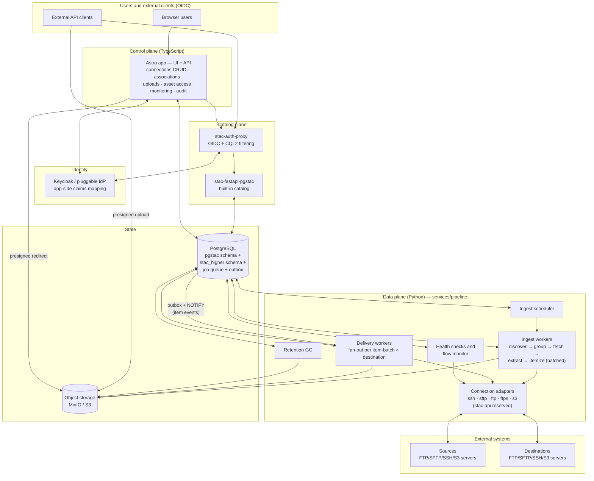
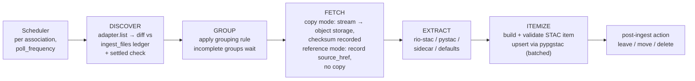
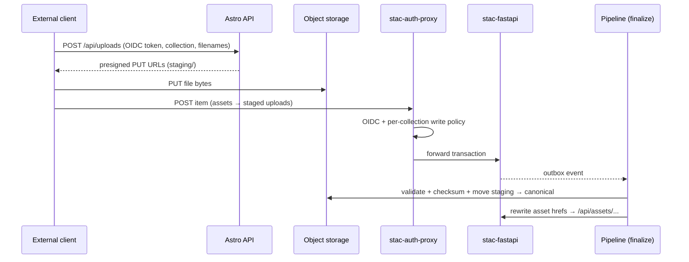
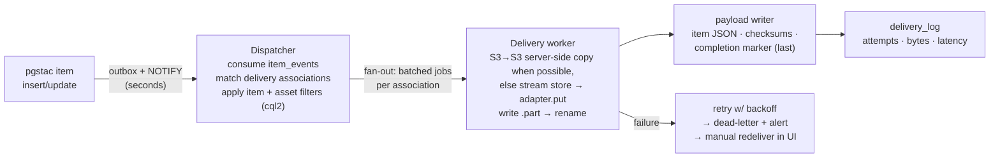
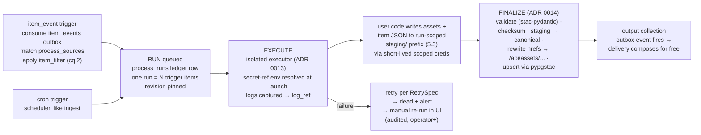

# ROADMAP — Ingest · Catalog · Disseminate Platform

STAC Higher grows from a STAC client into an enterprise platform for **ingesting,
cataloging, and disseminating geospatial products**: files arrive through
connections, become STAC items in a built-in catalog with platform-owned object
storage, and are pushed out through delivery connections in near real time — at
Earth-Search-class scale, for gov/defense-adjacent deployments.

This document is the long-term plan: locked decisions, target architecture,
data model, flows, and a phased implementation roadmap. Each phase is designed
to be implemented over 1–3 working sessions and to be independently shippable.
**What has already shipped is catalogued in [`docs/FEATURES.md`](docs/FEATURES.md)**
(per-phase entry points and residuals) — this file keeps the spec (§1–§8), the
phase/milestone status board (§9), and the forward plan; the phase-by-phase
build narrative lives in FEATURES.md and git history.

---

## 1. Locked decisions

| Topic | Decision |
|---|---|
| Deployment model | Enterprise, multi-user. Cloud-portable; AWS first (GovCloud-compatible). Local dev stays a single `docker compose up`. Not air-gapped — AWS managed services are available where the deployment allows. |
| Compliance posture | Gov/defense-adjacent; FISMA High is the eventual operating environment. Consequences are first-class, not bolt-ons: audit logging from Phase 1, KMS-encrypted credentials, host-key pinning, documented network-policy requirements. |
| Scale envelope | Earth-Search class: **100k+ items/day sustained**, million-item backfills, assets 100 MB–multi-GB, and **most items delivered** to at least one destination. Supported honestly: FTP/SFTP endpoints carry NRT-subset volumes; full-envelope volume assumes object storage on at least one side of every flow. A load-test gate precedes any production scale claim (Phase 8). (**M3 raises the bar** to ~30 items/s ≈ 2.6M items/day — see §9; the byte-volume arithmetic in §2 is computed against the original envelope and must be redone as part of M3 scoping.) |
| Identity | OIDC with a pluggable IdP. Keycloak ships in docker-compose as the default; Cognito/Entra/Okta swappable per deployment. An **app-side claims-mapping layer** (per-deployment config mapping arbitrary claim paths → canonical `groups`/`roles`) is the compatibility contract — IdPs are not required to emit our token shape. |
| Access control | Connections are **group-owned**. Roles: `member` (view group connections, associate them), `operator` (create/edit/operate connections), `admin` (cross-group everything). |
| Catalog scope | Ingest/delivery associations attach to **built-in-catalog collections only** (enforced in the API). External catalogs stay browse-only in the client. A `stac-api` connection protocol (harvest another STAC API, CQL2-filtered) is a reserved future protocol — the adapter model must not foreclose it. |
| Ingest semantics | Configurable per collection↔connection association: file patterns, grouping rules, metadata strategy, poll frequency, and **storage mode** (`copy` default, `reference` for high-volume object-store sources). A source file that changes after itemization is a **new version of the same product**: re-fetch, replace asset, upsert same item id. |
| Delivery semantics | **Assets only**, laid out at the destination by a configurable path template, with a **configurable payload** per association (bare files / + STAC item JSON / + checksums / + completion marker). Event-driven, target latency in **single-digit seconds** plus transfer time. Item updates honor a per-association `on_update: redeliver \| ignore` knob. **Deletions never propagate** — destination drift is accepted. |
| Object storage | Ingested bytes are copied into platform-owned S3-compatible storage (MinIO locally, S3 on AWS) **by default**. `reference` mode catalogs items whose assets stay at the source. Either way, asset hrefs point at our asset service, never directly at storage or sources. |
| Retention | Per-collection **retention period**: when an item's age exceeds it, the item is removed from the catalog and its assets from object storage via async GC with a configurable grace window. Rolling-archive semantics; at envelope scale, deletion is a bulk code path. |
| Pipeline runtime | **Python** (`services/pipeline`): rio-stac/pystac/stac-pydantic for metadata + validation (stactools core is unmaintained — not a dependency); fsspec/paramiko/ftplib for protocol adapters, obstore for object-store I/O. |
| Topology | Modular monolith pipeline service. Postgres is system of record; the **job queue sits behind an interface with per-deployment backends**: Procrastinate (LISTEN/NOTIFY, default, zero added infra) or SQS (AWS deployments). Jobs are **batch-oriented** (one job = N files/items) so job rate stays low at envelope scale. Seams kept clean so modules can split into services when load demands. |
| Eventing | pgstac item changes → vendored statement-level trigger writing a **durable outbox table** (`item_events`), with NOTIFY as a wake-up signal only — never the payload channel. Catches items from *every* write path, survives dispatcher restarts, and sidesteps the 8 KB `pg_notify` cap that bulk upserts would blow through. |
| eoAPI alignment | Reuse the eoAPI ecosystem wherever it fits (see §4) rather than building parallel infrastructure. |

---

## 2. Scale & compliance envelope

The two answers that shape everything else:

**Byte volume is the binding constraint.** 100k+ full-size scenes/day with most
items delivered means **tens to hundreds of TB/day** through the platform if
every byte is copied in and pushed out. The design absorbs this three ways:

1. **`storage_mode: reference`** per ingest association — high-volume
   object-store sources are cataloged in place; the asset service still fronts
   every href (RBAC check → redirect to source), so catalog links stay uniform.
2. **S3→S3 server-side copy** on the delivery path — when source-or-canonical
   and destination are both object storage, bytes never stream through our
   workers.
3. **Honest protocol claims** — FTP/SFTP sources and destinations are
   supported at NRT-subset volumes (the ground-segment trickle), not at full
   envelope volume. The envelope assumes object storage on at least one side.

**FISMA High is the destination.** Not air-gapped — AWS (GovCloud) services are
in scope — but the control surface must be auditable from day one: append-only
audit log (Phase 1), KMS envelope encryption, TOFU-pinned host keys, deny-private
egress in code *plus* documented network policy, write-only credentials. A
formal control-mapping pass (FedRAMP High baseline) is an explicit pre-production
work item, tracked in §10.

---

## 3. Target architecture


```mermaid
flowchart TB
    subgraph clients["Users and external clients (OIDC)"]
        UI_USER["Browser users"]
        EXT["External API clients"]
    end

    subgraph idp["Identity"]
        KC["Keycloak / pluggable IdP<br/>app-side claims mapping"]
    end

    subgraph control["Control plane (TypeScript)"]
        APP["Astro app — UI + API<br/>connections CRUD · associations ·<br/>uploads · asset access ·<br/>monitoring · audit"]
    end

    subgraph catalog["Catalog plane"]
        SAP["stac-auth-proxy<br/>OIDC + CQL2 filtering"]
        SF["stac-fastapi-pgstac<br/>built-in catalog"]
    end

    subgraph data["Data plane (Python) — services/pipeline"]
        SCHED["Ingest scheduler"]
        IW["Ingest workers<br/>discover → group → fetch →<br/>extract → itemize (batched)"]
        DW["Delivery workers<br/>fan-out per item-batch × destination"]
        GC["Retention GC"]
        HC["Health checks and<br/>flow monitor"]
        ADP["Connection adapters<br/>ssh · sftp · ftp · ftps · s3<br/>(stac-api reserved)"]
    end

    subgraph store["State"]
        PG[("PostgreSQL<br/>pgstac schema +<br/>stac_higher schema +<br/>job queue + outbox")]
        OS[("Object storage<br/>MinIO / S3")]
    end

    subgraph external["External systems"]
        SRC["Sources<br/>FTP/SFTP/SSH/S3 servers"]
        DST["Destinations<br/>FTP/SFTP/SSH/S3 servers"]
    end

    UI_USER --> APP
    EXT --> SAP
    EXT -- "presigned upload" --> OS
    APP <--> KC
    SAP <--> KC
    APP --> SAP
    SAP --> SF
    SF <--> PG
    APP <--> PG
    APP -- "presigned redirect" --> OS

    PG -- "outbox + NOTIFY<br/>(item events)" --> DW
    PG <--> SCHED
    PG <--> IW
    PG <--> DW
    PG <--> GC
    PG <--> HC
    SCHED --> IW
    IW --> ADP
    DW --> ADP
    HC --> ADP
    ADP <--> SRC
    ADP <--> DST
    IW --> OS
    DW --> OS
    GC --> OS
```

**Plane separation (the load-bearing idea):**

- **Control plane — Astro app (TS).** All CRUD, permission checks, upload
  brokering, monitoring UI, audit-log writes. Never opens SSH/FTP sessions,
  never holds decrypted credentials.
- **Catalog plane — stac-auth-proxy + stac-fastapi-pgstac.** The built-in
  catalog, pre-seeded and undeletable in the client's catalog list.
  stac-auth-proxy enforces catalog read visibility and per-collection write
  rights from OIDC claims (CQL2 filters / OPA policy).
- **Data plane — pipeline service (Python).** The only component that decrypts
  credentials and moves bytes. Five modules behind one process initially:
  ingest scheduler, ingest workers, delivery workers, retention GC, health/flow
  monitor. All protocol access goes through one adapter interface:
  `list / get / put / delete / test`.
- **Postgres as spine.** One instance, four concerns: pgstac (catalog),
  `stac_higher` (platform entities), job queue, `item_events` outbox. The
  queue is an interface with two backends — Procrastinate for local/modest
  deployments, SQS for AWS — chosen per deployment, invisible to business
  logic. Batch-oriented jobs keep the job rate within Postgres-queue limits
  even at envelope scale.
- **Asset access.** Item asset hrefs point at
  `/api/assets/{collection}/{item}/{asset}` → RBAC check → 302 to a
  short-lived presigned object-store URL (canonical storage) or to the source
  (`reference` mode). Catalog links stay stable even if storage moves; storage
  is never exposed directly.

---

## 4. Reuse from the ecosystem

We are already on eoAPI's foundation (pgstac + stac-fastapi-pgstac). Adopt the
rest of the ecosystem where it fits — with eyes open about maturity:

| Project | Role here | Mode |
|---|---|---|
| [stac-auth-proxy](https://github.com/developmentseed/stac-auth-proxy) | OIDC auth + CQL2 content filtering in front of the built-in catalog; per-collection write policies (CQL2 transaction filtering, OPA available) | Adopt — transaction filtering is v1.0-era (Feb 2026); integration-test the write paths, don't assume them |
| [pypgstac](https://github.com/stac-utils/pgstac) | Bulk item upserts from ingest workers | Library |
| [rustac](https://github.com/stac-utils/rustac) | Bulk operations: backfills, exports, stac-geoparquet I/O | Evaluate in Phase 4; adopt for backfills if pypgstac alone can't hold the envelope |
| [rio-stac](https://github.com/developmentseed/rio-stac) + [pystac](https://github.com/stac-utils/pystac) | Metadata extraction (geometry, datetime, proj/raster extensions) in the EXTRACT stage | Library — **stactools core is unmaintained and is not a dependency**; individual `stactools-packages` may be vendored case-by-case |
| [stac-pydantic](https://github.com/stac-utils/stac-pydantic) + [stac-validator](https://github.com/stac-utils/stac-validator) | Validation gates: ITEMIZE output, push-ingest finalize, import QA | Library |
| [stac-asset](https://github.com/stac-utils/stac-asset) | Read half of delivery workers (multi-auth asset fetch) | Evaluate in Phase 5 |
| [obstore](https://github.com/developmentseed/obstore) | Object-store I/O in workers (much faster than fsspec/boto3 for many objects) | Library |
| [cql2-rs](https://github.com/developmentseed/cql2-rs) (Python bindings) | Evaluating delivery `item_filter` expressions in the dispatcher | Library |
| [eoapi-notifier](https://github.com/developmentseed/eoapi-notifier) / eoapi-k8s trigger SQL | **Pattern source only.** The NOTIFY trigger is a custom SQL file in eoapi-k8s, not a pgstac feature; raw NOTIFY is at-most-once with an 8 KB payload cap. We vendor the trigger pattern into a durable outbox (§5.4) instead. Watch pgstac's incoming `items_deleted_log`/`pgstac_updated_at` change-feed primitives — they may replace the vendored trigger. | Vendor pattern |
| [titiler-pgstac](https://github.com/stac-utils/titiler-pgstac) | Dynamic raster tiles for map previews of ingested imagery | Adopt in Phase 8 (stretch) |
| [eoapi-cdk](https://github.com/developmentseed/eoapi-cdk) / [eoapi-k8s](https://github.com/developmentseed/eoapi-k8s) | AWS/K8s deployment of the catalog-plane slice; extended with our app, pipeline, and storage | Adopt in Phase 8 |
| [stac-manager](https://github.com/developmentseed/stac-manager) | Dev Seed's OIDC STAC-CRUD admin UI — overlaps our curation UI | Watch for form-builder/plugin patterns; not adopted |

**Prior art worth mining, not adopting:** NASA **Cumulus** validates the
provider/connection model (its provider schema and "settled file" semantics are
the reference for §6.1); **Planet's Destinations API** is the design template
for the delivery tier (validated, encrypted, org-shared destination objects +
test-probe on creation). Nothing open-source or commercial covers STAC-keyed
push delivery to FTP/SFTP with path templates — that tier is greenfield.

Not adopted: eoAPI's Lambda ingestor API as-is — our push-ingest (Phase 7)
reuses its *pattern* (authenticated ingest + validation) on our storage and
RBAC instead.

---

## 5. Data model

New tables live in the existing `stac_higher` schema alongside `extensions`.
Migrations continue to run via the existing middleware mechanism (revisit in
Phase 0 if the pipeline service also needs migration authority).

> **This ERD is the design-time shape.** The canonical, current schema is the
> migration list in `app/src/lib/db/migrate.ts` (001–018 as of M2). Known
> deltas the diagram doesn't show: `collection_settings.archived` (016) and the
> `asset_gc` queue (017, ADR 0011); the split expectation fields
> (`expect_activity_within_seconds` / `deliver_within_seconds`, M2-A);
> `alerts.kind`/`channel_id`/`notified_at` + the dedup index,
> `notification_deliveries`, and `alert_reads` (014/015, ADR 0010);
> `delivery_log.delivered_assets`/`next_attempt_at` (009/011);
> `item_events.claimed_at`/`dispatch_attempts`/`next_dispatch_at` (011/012);
> soft-delete columns (010, ADR 0009); monthly partitioning of `item_events`
> and `audit_log` (018, ADR 0012).


```mermaid
erDiagram
    GROUPS ||--o{ CONNECTIONS : owns
    CONNECTIONS ||--o{ COLLECTION_CONNECTIONS : "used by"
    COLLECTION_SETTINGS ||--o{ COLLECTION_CONNECTIONS : "scopes"
    COLLECTION_CONNECTIONS ||--o{ INGEST_FILES : tracks
    COLLECTION_CONNECTIONS ||--o{ DELIVERY_LOG : records
    COLLECTION_CONNECTIONS ||--o{ ALERTS : raises
    CONNECTIONS ||--o{ ALERTS : raises
    GROUPS ||--o{ NOTIFICATION_CHANNELS : configures
    GROUPS ||--o{ PROCESSES : owns
    PROCESSES ||--o{ PROCESS_REVISIONS : snapshots
    PROCESSES ||--o{ PROCESS_SOURCES : "consumes from"
    PROCESSES ||--o{ PROCESS_OUTPUTS : "publishes to"
    PROCESSES ||--o{ PROCESS_RUNS : executes
    PROCESSES ||--o{ ALERTS : raises

    CONNECTIONS {
        uuid id PK
        text name
        text description
        text protocol "ssh|sftp|ftp|ftps|s3 (stac-api reserved)"
        jsonb config "host/port/root or bucket/region/endpoint"
        bytea credentials "encrypted envelope"
        text host_key "TOFU-pinned server key (SSH family)"
        timestamptz host_key_pinned_at
        text group_id "from IdP claims"
        text created_by
        text status "unverified|ok|error"
        timestamptz last_checked_at
        text last_error
    }
    COLLECTION_SETTINGS {
        text collection_id PK "built-in catalog"
        text group_id "owning group"
        boolean externally_writable
        int retention_days "null = keep forever"
        int gc_grace_days "default 30"
    }
    COLLECTION_CONNECTIONS {
        uuid id PK
        text collection_id "built-in catalog only (enforced)"
        uuid connection_id FK
        text direction "ingest|deliver"
        boolean enabled
        jsonb config "see 5.1"
        jsonb expectation "flow expectation, optional"
        jsonb flow_stats "files, bytes, last_activity_at, latency"
    }
    INGEST_FILES {
        uuid id PK
        uuid association_id FK
        text source_path
        int version "increments on source change"
        bigint size
        text fingerprint "mtime/etag"
        text checksum
        text status "seen|settled|fetching|stored|itemized|failed"
        text item_id "once itemized"
    }
    ITEM_EVENTS {
        bigint id PK "outbox, monotonic"
        text collection_id
        text item_id
        text op "insert|update|delete"
        timestamptz occurred_at
        timestamptz processed_at "null = pending"
    }
    DELIVERY_LOG {
        uuid id PK
        uuid association_id FK
        text item_id
        text status "pending|delivering|delivered|failed|dead"
        int attempts
        bigint bytes
        timestamptz item_created_at
        timestamptz delivered_at "latency = delivered - created"
    }
    ALERTS {
        uuid id PK
        text source "health|flow|job_failure"
        uuid connection_id FK "nullable"
        uuid association_id FK "nullable"
        text state "firing|acknowledged|resolved"
        text message
        timestamptz first_seen
        timestamptz last_seen
    }
    AUDIT_LOG {
        bigint id PK "append-only"
        text actor "sub claim"
        text actor_groups
        text action "create|update|delete|test|backfill|redeliver|ack|login"
        text resource_type
        text resource_id
        jsonb detail "no secrets, ever"
        timestamptz at
    }
    NOTIFICATION_CHANNELS {
        uuid id PK
        text group_id
        text kind "in_app|email|webhook"
        jsonb config
    }
    PROCESSES {
        uuid id PK
        text name
        text description
        text group_id "owning group"
        uuid current_revision FK
        boolean enabled
        timestamptz deleted_at "soft-delete per ADR 0009"
    }
    PROCESS_REVISIONS {
        uuid id PK
        uuid process_id FK
        jsonb runtime "see 5.6 — inline_python | container"
        text code "inline source; null for container"
        jsonb env "secret values are refs into 5.2 envelope"
        text created_by
        timestamptz created_at "immutable snapshot"
    }
    PROCESS_SOURCES {
        uuid id PK
        uuid process_id FK
        text collection_id "built-in catalog only (enforced)"
        jsonb trigger "see 5.6 — item_event | cron"
        boolean enabled
    }
    PROCESS_OUTPUTS {
        uuid id PK
        uuid process_id FK
        text collection_id "built-in catalog only (enforced)"
    }
    PROCESS_RUNS {
        uuid id PK
        uuid process_id FK
        uuid revision_id FK "pinned at execution time"
        text status "queued|running|succeeded|failed|dead"
        int attempts
        jsonb input_items "trigger item refs (one run = N items)"
        jsonb output_items "published item refs"
        text log_ref "object-storage key for captured run logs"
        timestamptz started_at
        timestamptz finished_at
    }
```

> The `PROCESS_*` entities are **Phase 9 (proposed, M5 — see §9)**: design-time
> shapes only, no migrations exist. The app owns their DDL per ADR 0001; the
> pipeline reads them and writes `process_runs` state columns, mirroring the
> `collection_connections`/`ingest_files` split. Hygiene stance (to be confirmed
> against ADR 0012's criteria in the Phase 9 design spec): `process_runs` is
> likely **not** partitioned — runs are verb targets (`re-run`) like
> `delivery_log` rows — and ages out via the `history_retention` sweep.

High-volume table hygiene shipped in M2-G per [ADR 0012](docs/decisions/0012-table-hygiene.md),
amending the original partition-everything plan: `item_events` and `audit_log`
are monthly-partitioned; `ingest_files`, `delivery_log`, and
`connection_checks` are deliberately **not** (their natural UNIQUE keys are the
upsert model) and age out via the conservative `history_retention` sweep.
`audit_log` retention is compliance-driven and configured per deployment,
never silently truncated — rows die only by partition DETACH+DROP.

### 5.1 Association `config` shapes

**Ingest** (`direction = 'ingest'`):

```jsonc
{
  "source_path": "/outgoing/products",
  "include": ["**/*.tif", "**/*.xml"],
  "exclude": ["**/*.tmp"],
  "poll_frequency_seconds": 300,
  "storage_mode": "copy",  // copy (default) | reference (assets stay at source; object-store sources only)
  "grouping": { "rule": "shared_basename", "timeout_seconds": 900, "on_timeout": "ingest_partial" },
  "metadata": { "strategy": "raster_auto", "sidecar": { "pattern": "{basename}.xml", "parser": "generic_xml" }, "defaults": { "datetime": "file_mtime" } },
  "post_ingest": "leave"   // leave | move:<path> | delete
}
```

**Delivery** (`direction = 'deliver'`):

```jsonc
{
  "path_template": "{collection}/{yyyy}/{mm}/{dd}/{item_id}/{filename}",
  "item_filter": null,               // optional CQL2 subset (evaluated via cql2 bindings)
  "asset_keys": null,                // null = all assets
  "payload": {                       // what lands beside the assets — all optional
    "item_json": true,               // STAC item JSON sidecar
    "checksums": "sha256",           // per-file sidecars: null | md5 | sha256
    "completion_marker": true        // manifest written LAST — multi-file products are complete when it appears
  },
  "on_update": "redeliver",          // redeliver (changed-checksum assets only) | ignore
  "overwrite": "if_newer",           // never | always | if_newer — if_newer is the sane default with on_update: redeliver
  "retry": { "max_attempts": 5, "backoff": "exponential" },
  "max_concurrent_transfers": 4      // per-connection concurrency cap
}
```

Deletions never propagate to destinations: delivered files are the consumer's
copy, and drift is accepted by design.

**Expectation** (optional, either direction):

```jsonc
{ "expect_activity_within_seconds": 3600 }          // ingest: data must flow
{ "deliver_within_seconds": 30 }                    // delivery: NRT SLO
```

### 5.2 Credentials & host keys

- Write-only through the API: never returned after creation, UI shows
  metadata only ("SSH key set", "secret key ····").
- Encrypted envelope at rest: AES-256-GCM under a master key from env/secrets
  locally; AWS KMS envelope encryption in cloud deployments. The encryption
  provider is an interface so the two coexist.
- Decryption happens only inside the pipeline service, at job execution time.
- **Server authentication (SSH family): TOFU with pinning.** The host key is
  captured on the first successful "Test connection", stored on the
  connection row, and any later mismatch hard-fails the job and flips the
  connection to `error` with an explicit re-verify action in the UI.

### 5.3 Object storage layout

```
{bucket}/
  assets/{collection}/{item_id}/{filename}     # canonical
  staging/{upload_id}/{filename}               # push-ingest uploads, TTL-cleaned
```

### 5.4 Event outbox

The pgstac trigger (vendored from the eoapi-k8s pattern, rewritten) is a
statement-level AFTER trigger with transition tables that **inserts one row
per item into `item_events`** — never a `pg_notify` payload, which caps at
~8 KB and would abort bulk-upsert transactions. A separate `pg_notify` (no
payload) wakes the dispatcher; on wake *or* on a poll interval, the dispatcher
consumes pending outbox rows in order. Restarts lose nothing; bulk loads of
any size are safe. When pgstac ships `items_deleted_log`/`pgstac_updated_at`
(in its unreleased changelog), re-evaluate whether the vendored trigger can be
replaced by polling pgstac's own change feed. Pin the pgstac version and
upgrade-test the trigger path — pgstac's internal trigger machinery is being
restructured upstream.

### 5.5 Security boundaries

- **Adapter egress policy (both layers):** the adapter layer refuses
  private/loopback/link-local targets by default (the pipeline analog of the
  app's `safeFetch`), with a per-deployment allowlist env for legitimately
  internal sources; *and* deployment docs specify the network policy
  (security groups / K8s NetworkPolicy) that constrains pipeline egress in
  hardened environments. An operator must not be able to point a "connection"
  at RDS, metadata endpoints, or MinIO admin.
- **Claims mapping:** a per-deployment config maps IdP claim paths to the
  canonical `groups`/`roles` model (e.g. `cognito:groups` → groups, Entra
  group GUIDs → names). The app trusts only the mapped output.
- **Audit:** every mutation, credential lifecycle event, test-connection,
  backfill, redeliver, and login lands in `audit_log` (append-only, no
  secrets in `detail`).

### 5.6 Process `trigger` / `runtime` shapes *(Phase 9, proposed)*

Both shapes are **cross-runtime contracts** (app Zod schema ↔ pipeline
reader) and get golden fixtures in `tests/contract-fixtures/` per the
existing rule, before any implementation.

**Trigger** (per `process_sources` row):

```jsonc
{ "kind": "item_event",            // new/updated items on the source collection,
  "item_filter": null }            //   batched off the item_events outbox like the
                                   //   delivery dispatcher; optional CQL2 subset
                                   //   (same evaluation path as delivery)
{ "kind": "cron",                  // scheduled, like the ingest scheduler
  "schedule": "*/15 * * * *" }
```

**Runtime** (per `process_revisions` row):

```jsonc
{
  "kind": "inline_python",         // code stored platform-side (revision.code) | "container" (image ref)
  "image": null,                   // container kind only: user-supplied image reference
  "memory_mb": 512,
  "timeout_seconds": 900,
  "retry": { "max_attempts": 3, "backoff": "exponential" }   // reuses the queue RetrySpec pattern
}
```

**Env secret-refs (extends §5.2):** `process_revisions.env` values that are
secrets are **references** into the existing encrypted-credentials envelope —
plaintext secrets never appear in process config, revisions, or audit detail.
Resolution happens only in the pipeline at run launch, and only into the
executor's environment (never into the platform worker's own process — ADR
0013's isolation boundary).

**Revisions:** code + config snapshots are immutable; "deploy" = create a
revision + set `current_revision`. Every run pins the revision that executed
it, aligning with ADR 0009's nothing-cascades-into-history stance.

---

## 6. Flows

### 6.1 Ingest A — poll-based (connections)


```mermaid
flowchart LR
    S["Scheduler<br/>per association,<br/>poll_frequency"] --> D["DISCOVER<br/>adapter.list → diff vs<br/>ingest_files ledger<br/>+ settled check"]
    D --> G["GROUP<br/>apply grouping rule<br/>incomplete groups wait"]
    G --> F["FETCH<br/>copy mode: stream → object storage,<br/>checksum recorded<br/>reference mode: record source_href,<br/>no copy"]
    F --> E["EXTRACT<br/>rio-stac / pystac /<br/>sidecar / defaults"]
    E --> I["ITEMIZE<br/>build + validate STAC item<br/>upsert via pypgstac (batched)"]
    I --> P["post-ingest action<br/>leave / move / delete"]
```

- **Jobs are batch-oriented:** one job carries N files/items (per stage, per
  association), so 100k items/day stays at single-digit jobs/sec regardless
  of queue backend. Backfills run as chunked bulk jobs (pypgstac/rustac),
  never per-item fan-out.
- Every stage is idempotent against the `ingest_files` ledger — re-runs never
  double-ingest.
- **Settled check:** a file must be unchanged (size/fingerprint) across two
  polls before it is eligible — FTP/SFTP sources are frequently mid-upload.
- **Re-ingest:** a fingerprint change on an already-itemized file is a new
  version of the same product — re-fetch, replace the asset in canonical
  storage, upsert the same `item_id` (ledger `version` increments). The
  update flows to delivery per each association's `on_update` policy.
- ITEMIZE validates via stac-pydantic (+ stac-validator on demand) before
  upsert.
- Asset hrefs in the created item point at `/api/assets/...` in both storage
  modes.

### 6.2 Ingest B — push via API (direct interaction)

For collections flagged **externally writable**:


```mermaid
sequenceDiagram
    participant C as External client
    participant A as Astro API
    participant O as Object storage
    participant P as stac-auth-proxy
    participant S as stac-fastapi
    participant W as Pipeline (finalize)

    C->>A: POST /api/uploads (OIDC token, collection, filenames)
    A-->>C: presigned PUT URLs (staging/)
    C->>O: PUT file bytes
    C->>P: POST item (assets → staged uploads)
    P->>P: OIDC + per-collection write policy
    P->>S: forward transaction
    S-->>W: outbox event
    W->>O: validate + checksum + move staging → canonical
    W->>S: rewrite asset hrefs → /api/assets/...
```

**As-built note (Phase 7, 2026-08-30):** two deltas from the diagram. The
final leg's href rewrite does **not** go back through stac-fastapi —
finalize upserts the rewritten item via **pypgstac** (`pgstac_writer`, the
ITEMIZE precedent; the upsert's outbox event drives delivery). And the
item POST's documented default is the app's **brokered BFF route**
(`/api/catalog/...`, spec §4.3 — synchronous pre-validation, snapshot,
audit), with the direct-to-proxy leg shown above supported but discouraged.
Client contract: `docs/push-ingest.md`.

### 6.3 Ingest C — manual (UI)

Item create/edit forms gain asset upload using the same presigned-upload path
as flow B, driven by our frontend.

### 6.4 Delivery (NRT)


```mermaid
flowchart LR
    T["pgstac item<br/>insert/update"] -->|"outbox + NOTIFY<br/>(seconds)"| DIS["Dispatcher<br/>consume item_events<br/>match delivery associations<br/>apply item + asset filters (cql2)"]
    DIS -->|"fan-out: batched jobs<br/>per association"| W["Delivery worker<br/>S3→S3 server-side copy when possible,<br/>else stream store → adapter.put<br/>write .part → rename"]
    W --> PAY["payload writer<br/>item JSON · checksums ·<br/>completion marker (last)"]
    PAY --> L["delivery_log<br/>attempts · bytes · latency"]
    W -->|"failure"| R["retry w/ backoff<br/>→ dead-letter + alert<br/>→ manual redeliver in UI"]
```

- **Isolation:** work is partitioned per destination — a slow FTP server never
  blocks another destination.
- **Transfer paths:** when both ends are object storage, use server-side copy
  (no bytes through workers); FTP/SFTP destinations stream, capped by
  `max_concurrent_transfers` — the primary NRT tuning knob.
- **Atomic visibility:** per-file `.part` → rename; for multi-file products,
  the completion marker (when enabled) is written last and is the "product is
  complete" signal for directory-watching consumers.
- **Updates:** `on_update: redeliver` pushes only assets whose checksums
  changed, honoring the overwrite policy. `ignore` makes delivery
  fire-once-per-item.
- **Deletes:** never propagated.
- **Late-added associations** apply to new items only; "backfill existing
  items" is an explicit, user-initiated action running as chunked bulk jobs.
- **Finalize gating:** for externally-writable collections, the insert event
  arrives while assets are still in staging — the dispatcher defers those
  items until the finalize step (§6.2) marks them ready, so delivery always
  streams from canonical storage and never double-fires on the href rewrite.

### 6.5 Retention & GC

*(Implemented by M2-F — [ADR 0011](docs/decisions/0011-retention-gc.md);
`pipeline/gc/`, migration 017.)*

- `collection_settings.retention_days` defines a rolling window per
  collection (`null` = keep forever).
- A scheduled GC job selects expired items in bulk, deletes them from pgstac
  (which emits `delete` outbox events for bookkeeping — deletions do not
  propagate to destinations), and marks their canonical assets for removal.
- Asset removal happens after `gc_grace_days` (default 30) — recoverable from
  oops-deletes; storage never leaks. Ledger and log rows age out per ADR 0012:
  partition drops for `item_events`/`audit_log`, the `history_retention`
  sweep for the UNIQUE-keyed tables.
- Manual item/collection deletion follows the same marked-then-collected path.

### 6.6 Observability

*(Implemented by M2-A/B/C/D/H — [ADR 0010](docs/decisions/0010-alerting-notifications.md);
`pipeline/flow/`, `pipeline/notify/`, `pipeline/metrics.py`, `/monitoring`.)*

- **Connection health:** scheduled lightweight checks (connect + list) update
  `status` / `last_checked_at` / `last_error`; real job failures feed the same
  status. Surfaced as badges on `/connections`.
- **Flow monitoring:** associations accumulate `flow_stats`; a monitor job
  evaluates declared expectations (§5.1) and raises alerts on violation.
  Absence-of-data is only detectable against a declared expectation — an
  empty poll may be normal.
- **Alerts:** `alerts` rows (firing → acknowledged → resolved) with
  dedup/re-fire on `last_seen`. Notification channels per group: in-app and
  webhook shipped; email is a deferred third `kind`.
- **Service telemetry:** Prometheus `/metrics` + structured JSON logs from
  day one; OpenTelemetry traces as later hardening.

### 6.7 Processes *(Phase 9, proposed)*

A **process** is a group-owned, user-defined transformation consuming items
from source collections and publishing items into output collections — the
third flow primitive alongside ingest and delivery associations.


```mermaid
flowchart LR
    T1["item_event trigger<br/>consume item_events outbox<br/>match process_sources<br/>apply item_filter (cql2)"] --> Q["RUN queued<br/>process_runs ledger row<br/>one run = N trigger items<br/>revision pinned"]
    T2["cron trigger<br/>scheduler, like ingest"] --> Q
    Q --> X["EXECUTE<br/>isolated executor (ADR 0013)<br/>secret-ref env resolved at launch<br/>logs captured → log_ref"]
    X --> S["user code writes assets +<br/>item JSON to run-scoped<br/>staging/ prefix (5.3)<br/>via short-lived scoped creds"]
    S --> F["FINALIZE (ADR 0014)<br/>validate (stac-pydantic) ·<br/>checksum · staging → canonical ·<br/>rewrite hrefs → /api/assets/... ·<br/>upsert via pypgstac"]
    F --> O["output collection<br/>outbox event fires →<br/>delivery composes for free"]
    X -->|"failure"| R["retry per RetrySpec<br/>→ dead + alert<br/>→ manual re-run in UI<br/>(audited, operator+)"]
```

- **Triggers:** `item_event` batches off the existing `item_events` outbox
  exactly like the delivery dispatcher (one consumer group per process
  source); `cron` rides the ingest scheduler pattern. Optional CQL2
  `item_filter` per source, same evaluation path as delivery.
- **Runs are batch-oriented ledger rows** (`process_runs`): `queued | running
  | succeeded | failed | dead`, attempts, timings, `log_ref`, input/output
  item refs. Dead runs get a manual **re-run** verb — the `redeliver` analog,
  audited, operator+.
- **Isolation:** user code never sees decrypted platform credentials, the DB,
  or canonical storage — it runs behind the ADR 0013 executor boundary and
  writes only to its run-scoped staging prefix (ADR 0014).
- **Composition:** finalized output items emit ordinary outbox events, so
  they flow to delivery associations like any other item. A process whose
  output collection is also (transitively) a source is a **feedback loop** —
  detected and refused at association time (cycle-detection scope is an open
  question, §10).
- **Test runs** from the UI cross the app↔pipeline boundary via a request
  table per ADR 0004, like `connection_checks`.
- **Monitoring:** `flow_monitor` gains process alert kinds (`process_failed`,
  `process_stalled` against a `run_within_seconds` expectation); `/metrics`
  gains per-process run/duration/outcome counters per the M2-H pattern.

---

## 7. Access control

Identity, groups, and role membership live in the IdP; the claims-mapping
layer (§5.5) normalizes them. The app maps canonical claims to capabilities;
`stac_higher` stores only resource↔group ownership.

| Capability | member | operator | admin |
|---|:-:|:-:|:-:|
| See group's connections (no credentials) | ✓ | ✓ | ✓ (all groups) |
| Associate connections ↔ collections | ✓ | ✓ | ✓ |
| Create / edit / delete connections | | ✓ | ✓ |
| Enable/disable flows, backfill, redeliver | | ✓ | ✓ |
| Manage collection exposure (visibility, externally-writable, retention) | | ✓ | ✓ |
| View audit log (own group / all) | | ✓ | ✓ |
| Manage groups, platform settings, see everything | | | ✓ |

Enforcement by plane:

- **Astro API** — connections, associations, uploads, asset access,
  monitoring, audit. Per ADR 0008 it is also the BFF for **built-in-catalog
  writes from browser sessions** (`/api/catalog/*`): the app injects the
  session access token server-side and the mutation is RBAC-gated + audited;
  the proxy remains the token-enforcement point.
- **stac-auth-proxy** — catalog reads (collection visibility as CQL2 filters
  derived from group claims) and writes (per-collection POST/PUT/DELETE
  policy) for non-browser clients, plus token validation for the BFF's
  forwarded writes. OPA integration available when policies outgrow static
  mapping.

---

## 8. UI surface

Every row is live except `/admin` (Phase 7+) and the parenthesized Settings
visibility knob (needs read-visibility, I-1).

The surface was reorganized by the **product-centric UI remodel** (ADR 0017,
2026-09-01): a persistent navy sidebar + slim top bar replace the top-header
nav, home became the product overview, and UI copy says *product / source /
destination / pipeline graph* while routes, APIs and schema keep
*collection / association / graph*. Design brief:
`docs/superpowers/specs/2026-08-31-ui-remodel-design.md`; slice log:
`app/UI-TODO.md`.

| Page | Contents |
|---|---|
| App shell | Navy sidebar (Products · Processes · Connections · Pipeline graph · Monitoring, with Catalogs/Search/Extensions under a collapsed **More**), stack-status footer, slim top bar with client-side global search, alert bell, theme toggle, user menu. Icon rail + sheet on narrow viewports. The catalog selector lives on the Catalogs and Search pages, not the shell |
| `/connections` | Direction filter + per-connection direction badges derived from associations, health chips, mono protocol tags; type-card create/edit form (S3, SFTP, SSH, FTP, FTPS); Test connection; host-key re-verify action on mismatch |
| Collection **Data flow** tab | Associate connections; ingest config (patterns, grouping, metadata, poll frequency, storage mode); delivery config (path template, filters, payload options, on_update, expectations); enable/disable; backfill/redeliver |
| Collection **Settings** | Group ownership, (visibility,) externally-writable flag, retention period, grace window, archived |
| `/monitoring` | Flow telemetry per association, delivery latency, alert list with ack/resolve, notification-channel management; alert bell in the top bar |
| `/admin` | Groups, cross-group connections/collections overview, audit-log viewer |
| Item forms | Asset upload via presigned flow |

**From the NOAA mockups (ADR 0017) — all landed except the last row:**

| Page | Contents | Status |
|---|---|---|
| `/` | Product overview: four stat tiles, connection-health chip strip, product list with health verdict + reason and a mini lineage glyph. Derived from `/api/monitoring/{graph,flows}` + `/api/alerts` only — no new endpoints | ✅ UI-3 |
| Product **Overview tab** | Health badge (30d success % where the history endpoint has one), visibility chips, **Lineage & distribution** panel (medium lineage strip), endpoints (STAC + OGC serving links when `serving_enabled`), recent items | ✅ UI-4 |
| `/processes` | Dashboard: per-process health, in/out product links, trigger summary, last run + duration, success rate, last-20-runs sparkline | ✅ UI-5 |
| `/processes/[id]` | Editor layout: definition + sources/triggers + outputs left, **CodeMirror 6** code pane and test run right, runs below; env vars (secret-refs), deploy, re-run | ✅ UI-5 (closes I-65) |
| `/graph` | Columnar pipeline graph: source connections → source products → processes → derived products → destinations, health-coloured nodes, legend, mono ids, not-wired section, plus the exact edge list. Fed by `/api/monitoring/graph` (M5-E) | ✅ UI-7 |
| Collection create/edit form | Mockup deltas: `item_assets` definitions, extent editors, license/keywords | ⬜ not started — out of the remodel's presentation-only scope |

The **lineage strip** is one shared presentational component at three zoom
levels (mini on home rows, medium on the product Overview tab, full on
`/graph`), so the three surfaces cannot drift apart visually. The 30-day
`flow_stats_daily` history rollup the original plan called for landed earlier
in M5-F; the remodel moved its per-source strip onto the process detail page,
where the source it describes is visible.

**Deliberate divergence from the mockups:** the mockups' "OGC API hosting"
*destination type* (expose a collection via Tiles/Features) is **not** a
connection row here — it maps to catalog-exposure knobs on collection Settings
plus the titiler-pgstac / tipg adoption. A serving toggle, not a delivery
flow. **Pulled forward from Phase 8 stretch (2026-08-27):** both services run
fine in docker compose, so OGC serving is local, cloud-independent work —
tracked in `TODO.md` "Pre-M5 hardening". Until read-visibility (I-1) lands,
the toggle can only expose collections that are already public.

RBAC for the Phase 9 surface follows §7: processes are group-owned; member
views, operator+ creates/deploys/re-runs; every deploy/run/re-run/cancel is
audited through the existing guard + `audit_log` pattern.

All new UI follows the existing conventions: Astro thin shells + React
islands, TanStack Query for server state, shared components in
`packages/shared` where reusable.

**UI remodel track (2026-08-31, ADR 0017):** the whole surface above is being
reoriented product-first — persistent navy sidebar shell (Catalogs/Search/
Extensions de-emphasized under "More", nothing removed), `/` becomes the
product list with at-a-glance health, a default Overview tab on collection
pages with a lineage panel, NOAA light-default theming, and full adoption of
the Phase 9 terminology note's "product / source / destination" copy
(copy-only; routes and APIs unchanged). Presentation-layer only by
invariant. Brief: `docs/superpowers/specs/2026-08-31-ui-remodel-design.md`;
queue: `app/UI-TODO.md` (runs parallel to the M3 scoping queue in
`TODO.md`).

---

## 9. Phases

Dependency chain: `0 → 1 → 2 → 3 → 4 → 5 → 6 → 7 → 8`, though 8's IaC work
can start in parallel any time after 2. Phase 9 (Processes, proposed) depends
on Phase 7's finalize step (**Phase 7 precedes 9** — settled 2026-08-27, ADR
0014) and on the M2 monitoring substrate.

**Steering order (settled 2026-08-27, local-first):** everything buildable in
`docker compose` lands before any cloud environment is targeted —
**M2-I → Phase 7 → Phase 9 (M5) → M3 → Phase 8 (M4)**. Cloud work begins at
Phase 8 and not before; until then cloud constraints (Fargate quotas,
GovCloud service availability) are tracked as paper investigations (P9-A,
I-61), never as deployments. This settles I-60: M5 precedes M3.

**Implementation status — 2026-08-21** (legend: ✅ done · 🚧 in progress · ⬜ not started):

| Phase | Status | Notes |
|---|---|---|
| 0 — Foundations | ✅ Done (2026-07-14) | Full local stack, queue interface, app-owned migrations. [FEATURES §Phase 0](docs/FEATURES.md). |
| 1 — Auth, RBAC & audit | ✅ Done | OIDC + claims mapping, dev-bypass, guard + append-only audit, opt-in proxy enforcement. Carried forward: per-collection **read-visibility** needs OPA / a filter factory (ADR 0002, I-1). [FEATURES §Phase 1](docs/FEATURES.md). |
| 2 — Connections | ✅ Done (live-verified 2026-07-16) | CRUD + credential envelope, adapters, egress SSRF policy, TOFU pinning, test/health bridge, `/connections` UI. [FEATURES §Phase 2](docs/FEATURES.md). |
| 3 — Object storage & asset service | ✅ Done (live-verified 2026-07-16) | Offline presigning, asset 302 route, uploads, staging TTL sweep (ADR 0005). [FEATURES §Phase 3](docs/FEATURES.md). |
| 4 — Ingest pipeline | ✅ Done (live-verified end-to-end 2026-07-20) | Slices A, B1–B5, C (`reference` mode). Done-when met: dropped file → catalogued item through the real scheduler, copy and reference both. [FEATURES §Phase 4](docs/FEATURES.md). |
| 5 — Delivery pipeline | ✅ Done (Slices A→D live/e2e-verified by 2026-07-25) | Outbox + NOTIFY dispatcher, delivery worker + payloads/policies, retry → dead-letter → redeliver, backfill bridge, Data-flow delivery UI. [FEATURES §Phase 5](docs/FEATURES.md). |
| 6 — Operable platform (M2) | ✅ Done (gate met 2026-08-28) | All slices M2-0…M2-H merged (alerts, channels/webhooks, `/monitoring` + bell, Settings tab, retention/GC, partitioning, `/metrics`); **M2-I rehearsal closed both done-when legs live** (evidence under the M2 milestone below). Open: the promotion PR (human). [FEATURES §Phase 6](docs/FEATURES.md), `TODO.md`. |
| 7 — Direct interaction | ✅ Done (gate met 2026-08-30) | All slices P7-B…P7-I merged (bearer auth, staged uploads, brokered BFF push path, finalize on the ADR 0014 seam, dispatcher gating, ADR 0015 proxy write policy, `push_rejected` alerting, `docs/push-ingest.md`); **P7-Z rehearsal closed the done-when live** (evidence under the Phase 7 entry below; two gate findings fixed — I-80). Open: the promotion PR (human) + human review of the provisionally-approved spec. [FEATURES §Phase 7](docs/FEATURES.md). |
| 8 — Cloud, scale gate & viz | ⬜ Not started | — |
| 9 — Processes | ✅ **Gate met 2026-08-31** (M5-G) | All slices M5-0…M5-F merged and the §1 done-when rehearsed live on the auth-enforced stack — evidence below. Two findings fixed during the rehearsal (item_event revision resolution; the run network could not reach object storage). Remaining human work: the promotion PR. |

### Named milestones (2026-07-24)

The phases remain the dependency spine, but the project steers by these gates —
there are no intermediate demos; the first demo is M1, complete:

- **M1 — Demoable core loop.** Ingest from one S3 bucket → built-in catalog
  (STAC API) → disseminate to another S3/MinIO destination, **driven entirely
  through the UI** (create connections, configure a collection's ingest *and*
  delivery associations in the Data-flow tab, watch the payload land), running
  **auth-enforced with real login**, surviving a dead destination (retry →
  dead-letter, not a stuck queue). The underlying byte loop is already
  live-verified (Slice B-ii, 23/23); M1 is the UI + auth + robustness shell
  around it. Requires: the pre-B-iii hardening wave (I-39 pair, ADR 0009
  soft-delete half, cross-runtime contract fixtures), Slice B-iii, Slice C,
  Slice D, and the ADR 0008 BFF (I-50) so the UI works under enforcement
  — **BFF implemented + integration-verified 2026-07-25** (9/9 vs the
  enforced stack: real session login → `/api/catalog` write with only the
  httpOnly cookie → 2xx through the proxy → `catalog_collection` audit row;
  anonymous 401; non-transaction paths 404; needs
  `SAFE_FETCH_ALLOW_HOSTS=localhost` in local dev, per the existing
  safeFetch rule).
  **M1 demo rehearsal RUN 2026-07-26 — full loop closed through the UI on
  the auth-enforced stack** (overlay compose up, anonymous transaction POST →
  401; app in `AUTH_MODE=oidc`): real Keycloak login as alice (operator) →
  created `m1 source`/`m1 dest` S3 connections in the wizard (MinIO
  `m1-source`/`m1-dest` buckets), both Test-verified **OK** through the ADR
  0004 bridge → created collection `m1-demo` via the BFF with the session
  token → configured the ingest source (poll 60s, `**/*.tif`) and the
  delivery destination (Slice D dialog: `{collection}/{yyyy}/{mm}/{dd}/
  {item_id}/{filename}`, item JSON + sha256 sidecars + completion marker,
  max_attempts 3) in the Data-flow tab → dropped `m1-scene-001.tif` in the
  source bucket → **item queryable in the catalog and full payload
  (asset + .sha256 + item JSON + .done) byte-identical in `m1-dest` 62 s
  after the drop**; Slice D panel showed `1 delivered / 1 attempt`. Dead
  destination: broke `m1 dest` credentials via the edit dialog (write-only
  replace), dropped scene-002 → delivery failed (`SignatureDoesNotMatch`
  surfaced in the status panel), attempts climbed 1→3 on the exponential
  sweep → **`dead`, `next_attempt_at` cleared (terminal, not a stuck
  queue)**; health sweep flagged the connection **Error** on `/connections`.
  Recovery: fixed credentials in the UI → **Redeliver** button on the dead
  row (audited `redeliver`, 202) flipped it into a fresh cycle → retry sweep
  delivered it (`delivered / 1 attempt`, sha256 verified). Audit trail for
  the whole rehearsal: 2 logins, 2 connection creates + 2 updates + 2 tests,
  1 BFF collection create, 2 association creates, 1 redeliver. **Two real
  findings, logged as ISSUES I-54/I-55 and TODO items:** (1) pgstac 0.9.10's
  `get_tstz_constraint` regex drops fractional seconds, so the second
  single-item load into a collection dies on a partition CheckViolation —
  live-hotfixed in the dev DB only (durable fix is its own task,
  M1-blocking on fresh stacks); (2) ingest jobs carry no queue-level retry
  and an itemize crash strands the ledger at `stored`, outside the I-52
  sweeps' reach (recovered by flipping to `failed`, which the sweep then
  re-drove exactly as designed). **Both findings resolved 2026-07-30** —
  I-54 was really schema drift (the v0.9.11 image never migrates a persisted
  volume; fixed by the `pgstac-migrate` compose one-shot + drift-guard test),
  I-55 by queue-level `RetrySpec` on the chain + deliver jobs and a
  stored-stall recovery sweep; see the ISSUES I-54/I-55 resolution notes.
  **Promoted:** `main` fast-forwarded to `ai/main` and pushed 2026-08-19.
  (The push exposed a verify/CI gap — CI's app-scoped `astro check` wasn't
  in local `verify`; six fixture type errors failed CI on main. Fixed, and
  root `verify` now runs the same check so the gates match.)
- **M2 — Operable platform** (Phase 6): monitoring/alerts, `/metrics`,
  partitioning + retention/GC, archived collections (ADR 0009's GC half).
  Scoped + sliced 2026-08-18 —
  `docs/superpowers/specs/2026-08-18-m2-operable-platform-design.md` is the
  approved design (10 slices M2-0…M2-I, worked through `TODO.md`).
  **Code-complete 2026-08-19: M2-0 through M2-H all merged** — flow
  telemetry (`flow_stats` rollups, split per-direction expectations), the
  alerts core (`pipeline.flow_monitor`, migrations 014/015, audited
  ack/resolve), notification channels (in-app + HMAC-signed webhooks via the
  pipeline-side `notify` ledger, ADR 0010), the `/monitoring` page + header
  alert bell, the collection Settings tab, retention & GC (`asset_gc`
  marked-then-collected queue, ADR 0011), table hygiene (partitioned
  `item_events`/`audit_log` + retention sweeps, ADR 0012 — the deliberate
  deviation from §5's partition-everything plan, forced by the ledgers'
  UNIQUE upsert keys), and Prometheus `/metrics` (M2-H). Migrations 013–018;
  residuals in ISSUES I-58/I-59.
  **Gate met: M2-I rehearsal RUN 2026-08-28 — both done-when legs closed
  live on the auth-enforced stack**, including every `pragma: no cover` SQL
  path from the M2 follow-ups. Promotion PR pending (human).

  *M2 rehearsal evidence (recorded by M2-I, 2026-08-28, times UTC):*
  Fresh-wiped stack (`down -v`), pipeline image rebuilt (build log ERROR-free),
  auth-enforced overlay up healthy; anonymous transaction POST → 401, reads →
  200. All 18 app migrations ran on the fresh DB, including 018's partition
  path. App on :4399 in `AUTH_MODE=oidc` (Cursor holds :4321 — the known
  gotcha; the `:4399` redirect URI was added to the Keycloak client at runtime
  via the admin API, realm file untouched). Rehearsal-only pipeline overlay
  shortened the crash-recovery windows (DELIVERY_STALL_SECONDS=90,
  WEBHOOK_STALL/RETRY/MAX=60/15/3) and allowed `host.docker.internal` egress
  for a host-side webhook receiver. **Setup 100% UI-driven as alice
  (operator)**: real Keycloak login → `m2 source`/`m2 dest` S3 connections
  (both Test → ok through the ADR 0004 bridge) → collection `m2-demo` via the
  BFF → Data-flow ingest source (poll 60s, `**/*.tif`,
  `expect_activity_within_seconds=120`) + delivery destination (item JSON +
  sha256 sidecars + completion marker, `deliver_within_seconds=120`) → signed
  webhook channel on /monitoring.
  **Flow leg:** dropped a GeoTIFF → itemized → catalogued (`/api/assets/...`
  href) → delivered in 92ms with full payload; sha256 sidecar verified.
  Stopping the source raised `ingest_inactivity` within window+one tick;
  the webhook landed 70ms later with `X-StacHigher-Signature` (HMAC
  recomputed offline: match); the header bell showed unread 1 and opening
  /monitoring advanced `alert_reads`. Observed live against real Postgres:
  re-fire bumps `last_seen` on the SAME row (no duplicate, no re-notify),
  audited **ack** suppresses notification while `last_seen` keeps bumping,
  recovery **auto-resolves**, a later breach re-raises as a NEW row, and
  audited manual **resolve** works. **Crash legs:** a worker SIGKILLed
  mid-transfer (324MB item frozen at `delivering` via paused MinIO) was
  revived by the delivery stall sweep → delivered, attempts 2; a worker
  killed mid-webhook-POST left the notification `delivering` → stall revival
  → 500-retries to the attempts cap → **dead** → channel-anchored
  `webhook_failed` alert → next successful POST auto-resolved it.
  **Retention leg:** item backdated via audited BFF PUT; Settings tab set
  `retention_days=1`/`gc_grace_days=0`; the warn-and-proceed dialog showed
  the counted dry-run ("1 of 3 items…"); the next five-minute tick expired
  the item (`asset_gc` mark-first, reason `retention`) and `asset_collect`
  removed the canonical prefix 57ms later — **item 404s from the catalog,
  bytes gone from MinIO, and the already-delivered destination payload
  remained** (delete events do not propagate, §6.4). **Consistency:**
  `flow_stats->counts` exactly equaled `GROUP BY status` over `delivery_log`
  (4 delivered) after the whole sequence; `/metrics` counters ticked
  throughout. **Findings** (logged in ISSUES/TODO): the item edit form
  crashes on pipeline-ingested items carrying `proj:geometry` (RJSF can't
  resolve the remote GeoJSON schema $ref — I-67); the Settings tab copy
  still says retention "arrives with M2-F"; Keycloak's default 30-min SSO
  idle ends long-idle operator sessions (handled cleanly; demo realms may
  want it longer).
- **Phase 7 — Direct interaction (push ingest): gate met 2026-08-30** —
  the P7-Z rehearsal closed the done-when live on a fresh-wiped
  auth-enforced stack. Design:
  `docs/superpowers/specs/2026-08-29-phase7-push-ingest-design.md`
  (provisionally approved through two adversarial review rounds — human
  review pending); ADR 0015 accepted; slices P7-B…P7-I + the P7-X I-67 fix
  all merged 2026-08-30; migrations 020–021; client docs
  `docs/push-ingest.md`. Promotion PR pending (human).

  *Phase 7 rehearsal evidence (recorded by P7-Z, 2026-08-30, times UTC):*
  Fresh `down -v`, enforced overlay `up --build --wait` (the missing-secret
  fail-fast interpolation error observed working when the shell lost the
  secret); all 8 containers healthy — including the derived proxy-policy
  image passing its startup conformance check, settling the P7-G derived-
  image and CHECK_CONFORMANCE confirms. Realm re-import surfaced a P7-B
  defect (push-client description over Keycloak's 255-char column — fixed).
  App on :4399 in `AUTH_MODE=oidc`. **Full four-step client loop with a
  real `stac-higher-push` client-credentials token**: bearer settings PUT
  (audited, migrations 020/021 ran on the fresh DB) → staged mint →
  presigned PUT → brokered POST (provisional 201) → poll `finalized`;
  hrefs rewritten to `/api/assets/...`, staged originals deleted, and the
  asset route's 302 round-tripped the bytes byte-identical to the finalize
  checksum. **Delivery leg:** an s3 deliver association (MinIO `push-dest`)
  fired from a pushed item exactly once (`counts` delivered=1 — §7.2's
  no-double-fire pair held live). **Rejection legs:** a never-uploaded
  staged href rejected `missing_bytes`; the insert tier restored absence
  (item 404s); the `push_rejected` alert raised collection-anchored within
  a monitor tick — migration 021's widened anchor CHECK + dedup index and
  the monitor's ON CONFLICT exercised against real Postgres; a brokered
  update rejection restored the `prior_item` snapshot (`restored: true`,
  pre-push document back verbatim, zero open GC marks on the live item).
  **Integration suite: 14 pass / 0 fail / 3 skip** on the enforced stack —
  incl. bulk-deny (clean 403 `ForbiddenError`, settling the P7-G rejection-
  shape question), the X-BFF-Auth exempt/wrong-value pair, role floor +
  flag gating, and read-shape legs. **e2e: 32/32** on pass-through
  (`E2E_PORT=4399`). **Gate findings, both fixed on `ai/main` during the
  rehearsal:** (1) **I-46 delete+insert pairs** — the transaction-API path
  splits a client PUT into delete+insert events, which made the dispatcher
  GC-mark a LIVE item's canonical prefix on every update push and made
  finalize's op-discriminated tiers delete a rejected update instead of
  restoring it (observed live, rejection reason `gc_pending` from the
  spurious mark). Fixed: the dispatcher skips the mark when the item still
  exists at claim time; finalize discriminates snapshot-first and deletes
  only a provable create (`item_predates` against `item_events`); ISSUES
  **I-80** records the residuals. (2) **CQL2 constant serialization** — the
  factory's bare `true`/`false` literals serialize to JSON booleans that
  stac-fastapi's filter model rejects (every enforced-mode read 400'd);
  fixed as `1 = 1` / `1 <> 1` expressions. Plus a docs nit: the poll
  response nests under `upload` (docs example showed it flat).
- **M3 — NOAA-scale readiness:** sustained ~30 items/s (~2.6M items/day,
  mission-critical subscribers) — dispatcher throughput headroom beyond
  Slice C, concurrency-safe multi-worker operation (I-40 and the ingest-ledger
  claims), and a measured load rehearsal against a synthetic 30 items/s feed.
  This pulls the Phase 8 load-gate *measurement* forward; the AWS/IaC half of
  Phase 8 stays put. **Not yet scoped** — needs its own design spec (the M2
  pattern), including redoing §2's byte-volume arithmetic at the 20×-higher
  item rate. **Scoping started 2026-08-31**: the scoping queue is seeded in
  `TODO.md` (M3-S-A…M3-S-G, spec + lead stop point at the end) with inputs
  collected in
  `docs/superpowers/specs/2026-08-31-m3-scoping-notes.md`.
  **Scoping complete 2026-09-01**; findings appended to those notes and the
  design spec written and **approved 2026-09-01**:
  `docs/superpowers/specs/2026-09-01-m3-noaa-scale-design.md`; the M3-A…M3-I
  implementation queue is live in `TODO.md`. Headline: the gap is four small defects, not a re-architecture —
  pgstac's inline `update_partition_stats` (O(partition) per write call;
  `use_queue = true` took the measured pipeline from 2–3.5 to 22 items/s with
  no code change), the Procrastinate worker's default `concurrency = 1`,
  whole-object buffering, and no connection pooling. §2's byte arithmetic is
  redone in the notes (M3-S-B): ~88 TB/day ingest-origin, ~197 TB/day through
  the workers in full copy mode, and reference mode corrected to a storage
  lever rather than a bandwidth one.
- **M4 — Production deployment** (Phases 7–8 as required by the target
  environment).
- **M5 — Processes** (Phase 9, proposed 2026-08-27): user-defined
  transformations as the third flow primitive — group-owned processes with
  immutable revisions, isolated execution (ADR 0013), staged-then-finalized
  output (ADR 0014), the `/processes` + `/graph` UI surface, and process
  alert kinds in the monitor. **Ordering settled 2026-08-27 (I-60): M5
  precedes M3** — the number is creation-order, not execution-order.
  Processes is locally buildable; the M3 load measurement is the natural
  point to include process-generated volume, so M3's scale arithmetic MUST
  count process output items (§10). **Slice-1 scope constraint** (ADR 0013):
  `inline_python` on a platform-built executor image only — user-supplied
  `container` images are a later slice, keeping image supply-chain review
  out of the first accreditation surface. **Not yet scoped** — needs its own
  design spec (the M2 pattern) worked from the Phase 9 section, the two
  proposed ADRs, and the `TODO.md` scoping queue.

### Phases 0–5 — delivered

Per-phase delivery detail (entry points, slice narratives, residuals) lives in
[`docs/FEATURES.md`](docs/FEATURES.md); the full build history is in git (this
file's pre-2026-08-21 revisions carried the slice-by-slice narrative) and in
the M1 evidence above. Every done-when was met live: Phase 4's dropped-file →
catalogued-item (2026-07-20) and Phase 5's item-change → destination payload
with retry/dead-letter/redeliver (2026-07-25), both re-proven end-to-end by
the M1 rehearsal.

### Phase 6 — Observability & retention ✅ **Done (M2 gate met 2026-08-28)**

All planned surface is built (see the M2 milestone above and
[FEATURES §Phase 6](docs/FEATURES.md)): flow expectations + monitor +
alerts lifecycle, retention GC per §6.5 with ADR 0012's amended hygiene plan,
`/monitoring` + header bell + Settings UI, in-app + webhook notification
channels (email deferred), Prometheus metrics + structured logging.
- **Done when:** stopping a source's data flow raises an alert within the
  declared expectation window and notifies the group's channels; an expired
  item leaves the catalog and, after the grace window, object storage.
  **Met — proven live by the M2-I rehearsal 2026-08-28** (evidence under the
  M2 milestone in §9).

### Phase 7 — Direct interaction (push ingest) 🚧 **Implemented, gate pending (2026-08-30)**

All implementation slices merged (design spec
`docs/superpowers/specs/2026-08-29-phase7-push-ingest-design.md`,
provisionally approved; human review of spec + code pending):

- Externally-writable flag per collection — **now enforced** (ADR 0015:
  the `services/proxy-policy/` items-filter factory in the auth-enforced
  overlay; `bulk_items` denied; the BFF exempted via a shared secret) after
  sitting dormant since migration 003.
- Finalize step per §6.2 (as amended above): stac-pydantic validate →
  checksum → move to canonical → rewrite hrefs → **pypgstac** upsert, on
  ADR 0014's producer-parameterized seam (stac-validator extension
  validation stays deferred — ISSUES I-73).
- API client docs: `docs/push-ingest.md` (bearer auth, staged uploads, the
  brokered-default/direct-discouraged split, rejection semantics).
- **Done when:** an external client with a token can upload a file and POST
  an item, the item finalizes into canonical storage, and delivery fires
  from it like any other item. **Not yet claimed** — the P7-Z live gate
  check (auth-enforced stack rehearsal + full e2e, evidence recorded here
  M-gate style) and the promotion PR remain.

### Phase 8 — Cloud deployment, scale gate & visualization ⬜ **Not started**
- AWS stack via eoapi-cdk extended: RDS (pgstac), S3, KMS, ECS/Fargate (app,
  pipeline, proxies), Cognito-or-Keycloak decision per deployment
  (GovCloud-compatible service choices).
- **SQS queue backend** behind the Phase-0 interface; deployment config picks
  Procrastinate or SQS.
- **Load-test gate:** drive the envelope (100k items/day ingest + delivery
  fan-out, million-item backfill) against both queue backends; production
  scale claims follow the measurements, and pipeline modules split into
  services only if the numbers say so.
- Stretch: raster previews in the collection/item UI (rides on the OGC
  serving services — titiler-pgstac/tipg themselves were **pulled forward
  to local work 2026-08-27**, see §8 and `TODO.md` "Pre-M5 hardening";
  Phase 8 keeps only their cloud deployment).
- **Done when:** the full ICD loop runs on AWS from IaC, with KMS-encrypted
  credentials, S3 object storage, and a written load-test report against the
  envelope.

### Phase 9 — Processes ✅ **Gate met (M5-G, 2026-08-31)**

User-defined, group-owned transformations that consume items from **source
collections** and publish items into **output collections** — the third flow
primitive alongside ingest and delivery associations. Derived from the NOAA
Geospatial Data Platform mockups; requirements translated into this repo's
terms. Planning artifacts: §5 `PROCESS_*` entities + §5.6 config shapes,
§6.7 flow, the §8 Phase 9 UI table, [ADR 0013](docs/decisions/0013-process-executor-isolation.md)
(executor isolation) and [ADR 0014](docs/decisions/0014-process-output-path.md)
(output path) — **both accepted 2026-08-29 by the approved design spec**
(`docs/superpowers/specs/2026-08-29-phase9-processes-design.md`, slices
M5-0…M5-G) — the completed `TODO.md` scoping queue, and ISSUES I-60…I-66.
Sequencing settled 2026-08-27: Phase 7 precedes 9; M5 precedes M3 (see the
steering order above). Slice 1 is `inline_python`-only (ADR 0013); the OGC
API — Processes facade was evaluated (I-66) and settled as a post-gate
stretch — conformance posture and the Parts 2–5 outlook are ADR 0016
(2026-08-31).

- **Data model:** `processes`, `process_revisions` (immutable code+config
  snapshots; deploy = new revision), `process_sources` (built-in-catalog
  collections only, `item_event`/`cron` triggers, optional CQL2 filter),
  `process_outputs`, `process_runs` (batch ledger with `re-run` verb). App
  owns all DDL (ADR 0001); trigger/runtime shapes are cross-runtime
  contracts with golden fixtures.
- **Pipeline:** a `pipeline/processes/` module (executor + repo); dispatcher
  matching extended to process sources; scheduler extended for cron
  triggers; `flow_monitor` extended with `process_failed`/`process_stalled`
  (against a `run_within_seconds` expectation); `/metrics` counters per the
  M2-H pattern; UI test runs bridged via a request table (ADR 0004).
- **Execution & output:** user code is untrusted relative to the platform —
  it runs behind the ADR 0013 executor boundary (recommendation:
  container-per-run behind an executor interface, mirroring the Phase-0
  queue-interface pattern) and never writes pgstac or canonical storage
  directly; outputs land in a run-scoped staging prefix and are finalized by
  the platform (ADR 0014 — Phase 7's finalize step with a different
  producer; the dependency or shared-slice opportunity is explicit).
- **UI:** `/processes`, `/processes/[id]`, the `/graph` pipeline view, the
  collection lineage panel, and the overview rollup (§8 Phase 9 table).
- **Done when** (to be firmed up by the design spec): an operator can create
  a process in the UI, deploy a revision, watch an item landing in a source
  collection produce a validated item in the output collection through an
  isolated run, see the run (and its logs) in `/processes`, and see the
  output item deliver onward through an ordinary delivery association —
  with a failed run going dead → alerting → manually re-run.

**Terminology note (mockup ↔ repo).** The mockups say **product** for a
built-in-catalog collection (+ its settings and flows), **destination** for a
deliver association, and **pipeline graph** for the flow topology. The repo's
existing vocabulary — collection, ingest/deliver association, flows,
monitoring — stays canonical in schema, code, and docs; UI copy MAY adopt
"product" later, which is a copy decision, not a schema one. The mockups'
"OGC API hosting" destination type is deliberately re-mapped to a serving
toggle (§8), not a connection.

### Beyond the phases
- **`stac-api` harvest protocol**: poll an external STAC API with a CQL2
  filter, mirror matching items (metadata-only via `reference` mode, or with
  asset copy). The adapter enum, `storage_mode`, and association config are
  designed so this drops in without schema changes.
- **OGC API — Processes conformance** (posture set 2026-08-31,
  [ADR 0016](docs/decisions/0016-ogc-processes-conformance-posture.md)):
  conformance is a goal, pursued as the §11 facade over the canonical
  internal model — Part 1 v1.0 claim targets now, the v2.0 draft's
  `collection-output` as the planned representation of output collections,
  Part 5 (PROV) as a cheap add-on off the run ledger. Parts 2–4 are mapped
  with reasoning in the ADR; two constraints bind current work (container
  runtime must not foreclose Application Packages; run↔item provenance
  linkage stays queryable). The facade slice stays post-M3, lead-gated.
- **FISMA High control mapping**: a formal pass against the FedRAMP High
  baseline (inventory: audit coverage, encryption, session policy, boundary
  docs) before any accredited deployment.

---

#### M5-G gate evidence (2026-08-31)

Rehearsed against the **auth-enforced stack** (`docker-compose.yml` +
`infra/compose.auth-enforced.yml`, `CATALOG_BFF_SHARED_SECRET` set) with the
pipeline image rebuilt from `ai/main`, the platform runtime image built from
`services/process-runtime/`, and the dev server on :4321. Fixture collections
`m5g-source` / `m5g-output` were created directly against stac-fastapi —
collection creation by a session caller needs a real OIDC login under
enforcement, and it is fixture setup rather than a gate assertion.

Each §1 criterion, and how it was observed:

1. **Trigger → run.** An item landing in `m5g-source` produced a
   `process_runs` row with the deployed revision pinned. The dispatcher's
   process leg matched the source and enqueued `pipeline.process_trigger`.
2. **Isolated execution + captured log.** The run executed as a sibling
   container through the socket proxy (not in the worker), and its stdout /
   traceback was captured to
   `logs/runs/{process_id}/{run_id}.log` and referenced from `log_ref`.
3. **Validated output item.** `m5g-output` gained
   `m5g-out-c5ca3b8a` with asset href
   `/api/assets/m5g-output/m5g-out-c5ca3b8a/mask.tif` — bytes moved
   staging→canonical and hrefs rewritten by the Phase 7 finalize through the
   ADR 0014 `process_run` hooks; `output_items` recorded on the run.
4. **Onward delivery.** A deliver association on `m5g-output` (s3 → MinIO)
   delivered the process's output items: `delivery_log` `delivered`, with the
   bytes present at the templated destination path. Composition off the
   finalize upsert's outbox event, with no process-specific delivery code.
5. **Failure → dead → alert → Re-run.** A failing run exhausted its retry
   budget to `dead`; the monitor raised **`process_failed`** (process-anchored,
   group derived as `earth-observation`, visible through `/api/alerts` and
   counted by the unread bell). `POST …/runs/{id}/rerun` returned 202, reset
   the row to `queued` with a fresh budget, and wrote an audited `rerun` row.
6. **Stall → alert → auto-resolve.** While the flow was stopped, the source's
   `run_within_seconds: 60` expectation breached and raised
   **`process_stalled`** (source-anchored, per I-63); it **auto-resolved** once
   a run succeeded — which also exercises the M5-E auto-resolve fix, since the
   comparison must include the process/source legs to clear the right row.

Also exercised beyond the six:

- **Cycle refusal (I-64).** Attaching `m5g-source` as an output of a process
  that already sources from it returned 409 with the path
  `proc:… → coll:m5g-source → proc:…`.
- **Rate ceiling (§7).** With `max_runs_per_hour: 1`, three triggers produced
  **one** deferred run carrying **three** items — coalescing proven under real
  concurrent dispatch — and raised **`process_rate_limited`**.
- **Stall sweep.** A run stranded `running` past the window was returned to
  `queued` with `started_at` cleared and an explanatory error.

**Two findings, both fixed and merged during the rehearsal:**

- *`item_event` triggers never resolved their revision.* The trigger job read
  the current revision by scanning `list_due_cron_sources`, which filters to
  `cron` triggers — so every item_event run was dropped as "nothing deployed".
  The dispatcher leg was correct; the drop happened one job later, which is
  why a unit suite testing the two separately missed it. Replaced with a
  single-row `current_revision()` read plus a regression test.
- *A run could never reach object storage.* The `process-runs` network was
  `internal: true` with **nothing attached**, and `PROCESS_NETWORK` defaulted
  to `none` — so every publishing run died with `EndpointConnectionError`
  against `minio:9000`, making the whole ADR 0014 output path unreachable in
  the shipped stack. MinIO now joins that network and compose defaults to it;
  the isolation that matters is preserved and is now deliberate: a run reaches
  object storage and nothing else — not the database, not the catalog API, and
  not the socket proxy that launches runs.

## 10. Risks & open questions

- **Byte-volume economics:** the envelope implies 10s–100s of TB/day. The
  mitigations (reference mode, server-side copy, honest FTP claims) are
  design-level — validate transfer costs and throughput in the Phase 8 load
  test before contractual scale commitments. M3's ~30 items/s target is 20×
  the original item rate; its scoping must redo this arithmetic.
- **pgstac trigger restructuring:** upstream is replacing its item-trigger
  machinery, and `items_deleted_log`/`pgstac_updated_at` (a poll-friendly
  change feed) is landing. The vendored outbox trigger was kept through
  Phase 5 (the native feed hadn't shipped in the pinned 0.9.11); pin pgstac,
  upgrade-test the trigger on each bump, and re-evaluate the native feed at
  the next pgstac upgrade (I-23 lockstep).
- **stac-auth-proxy transaction filtering is young** (v1.0.0, Feb 2026):
  adopted and integration-tested (the enforcement suite + BFF leg); watch
  upstream for breaking filter-factory changes.
- **Postgres-queue ceiling:** batch-oriented jobs keep the envelope within
  Procrastinate's comfort zone on paper (single-digit jobs/sec against the
  original 100k/day envelope); the Phase 8 load test — and M3's 30 items/s
  rehearsal before it — decide where the Procrastinate→SQS boundary actually
  sits per deployment size.
- **Grouping edge cases:** multi-file products with unreliable arrival order
  are the perpetual ingest headache; the timeout + partial-ingest policy is
  the escape hatch, expect tuning.
- **FTPS/SSH variance in the wild:** implicit vs. explicit FTPS, SCP-only SSH
  hosts, keyboard-interactive auth — adapter layer needs a compatibility
  matrix and integration tests against containerized servers (FTPS live
  coverage still blocked on arm64, I-6).
- **Scheduler/monitor HA:** the poll scheduler, dispatcher listener, and flow
  monitor are all singletons today (safe — atomic claims make overlap
  harmless, so this is throughput, not correctness; I-40). Leader election or
  partitioned ownership is due when the monolith first scales horizontally,
  at latest in Phase 8 / M3.
- **Processes multiply item throughput (Phase 9, proposed):** every
  process-generated item is a full catalog item that fans out to delivery
  like any other — and with M5 sequenced before M3 (I-60 settled), M3's
  ~30 items/s arithmetic MUST include process-generated volume. A
  misconfigured high-fan-out process is also a self-inflicted load
  amplifier; per-process rate/backlog limits belong in the design spec.
- **Untrusted user code in a FISMA-High-bound platform (Phase 9):** the
  executor boundary (ADR 0013) is a new, security-critical surface — local
  dev (docker socket availability) and GovCloud (Fargate task quotas,
  image-registry policy) may force different backends behind the interface
  (I-61), and the container path adds image supply-chain review to the
  compliance story. The inline-editor frontend dependency (CodeMirror vs.
  Monaco) needs its own supply-chain review before adoption (I-65).
- **Process feedback loops:** output→source cycles (direct, or transitive
  through delivery→re-ingest edges) can run away silently; the refusal
  check's scope is an open question (I-64) — too narrow misses real loops,
  too broad (full transitive closure across external systems) is
  undecidable. **Backstop requirement (settled 2026-08-27):** whatever the
  detection scope, a per-process run-rate ceiling with an alert on breach
  is a design-spec requirement — it caps the blast radius of any loop the
  detector cannot see.

Settled since first drafted: **high-volume table hygiene** (M2-F/M2-G, ADR
0011/0012 — the partition-vs-sweep split); **migration ownership** (Phase 0,
ADR 0001); **pre-existing collection defaults** (unowned + public, ADR 0003).
